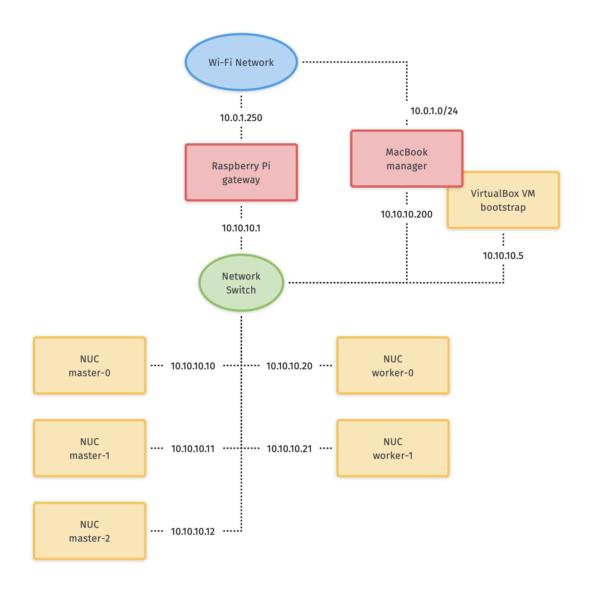
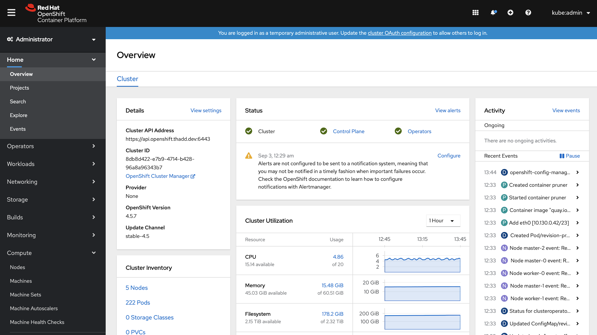

= Building a Light-weight OpenShift Cluster
:sectanchors:
:sectlinks:
:sectnumlevels: 6
:sectnums:
:toc: macro
:toclevels: 6

toc::[]

== Introduction

I've been wanting more flexibility to play and experiment with OpenShift. There are a lot of options for how to get OpenShift from hosted solutions like https://www.openshift.com/products/online/[OpenShift Online] to self-hosting on Amazon to running locally via https://github.com/code-ready/crc[CRC]. These are all great options but I had a few extra desires that made them less than the ideal solution:

* I want cluster admin privileges. I'm using this cluster to learn more about what it's like to manage an OpenShift cluster and that requires cluster admin. I also want the option to dig into learning more about Custom Resource Definitions and CRDs require cluster admin.
* I don't want any recurring costs. AWS might be the cheapest approach overall that hits my other requirements, but I didn't want to have to have to remember to idle things or worry about storage costs, even if they're tiny.
* I want it to be a real, long-lived cluster. I'm going to be building demo apps and maybe even use the cluster for some personal projects. To do that, it needs to be persistent and always online. I can't have it dependent on my laptop or only spin it up for a few hours at a time. I can't use a demo system that has a 4-day lifespan.
* I want to learn more about the install process.
* I want it to have the option of being portable. I find myself doing demos for customers and sometimes they have lousy network in the conference rooms or their guest networks are so locked down I can't really do my demos. If I had a briefcase sized cluster that I could plug my laptop into and that would work offline, it would solve a lot of those demo challeges.

With all of those (admittedly arbitrary) requirements laid out, I decided to build a bare-metal cluster that meets the minimal specs and see where it gets me. For the hardware itself, I opted for Intel NUCs. They're not the cheapest mini-PCs around, but at the time of writing you could get a quad-core with 16GB RAM and a 128GB SDD for about $325. So I bought 5 of them and set to building my cluster.

What follows is my experience and all of the headaches I hit along the way. My goal for this document is to provide a step-by-step guide on replicating my setup. I did this in August 2020 and installed OpenShift 4.5; caveats apply that things might have changed by the time you read this.

== Unboxing and Planning

In addition to my 5 NUCs, I picked up or used a few other things as the basis of my cluster:

* Raspberry Pi - I'm using this as the gateway to my cluster. It provides DHCP, DNS, PXE booting, load balancing, and firewall for my cluster nodes. I had a spare but you can pick up a Cannakit for well under $100.
* An 8-port network switch

You'll obviously also need a few things like a USB stick for NUC firmware updates, keyboard and mouse, a monitor to use for the NUCs during setup and of course a development machine to do the bulk of the work from. You can do these things however you want, but I also used a video capture card so I didn't have to finagle a monitor.

Here's the architecture plan for our cluster:

You can see we're using the Pi to bridge my home wifi network to the cluster network. There are times when I hooked my MacBook Pro to the wired network so I also needed a way to plug an ethernet cable to my Mac.

== Getting ready for installation

=== Setting up the NUCs

Here are the steps I took to get the NUCs ready for my cluster. The NUCs I bought came preinstalled with Windows so it was tricky at first to get into BIOS. Mashing F2 (Fn-F2 on my keyboard) caught it reliably.

. Update the firmware. This was not 100% necessary, but I thought it was best to start with the latest and greatest so I downloaded new firmware from Intel and clicked through the BIOS menus to update.
. Turn off secure boot.
. Change the boot order to boot from the network first.
. Enable "unlimited network boot tries" so it would never go to Windows or the disk OS until I was ready.
. Record the MAC addresses of each NUC. We'll use these for DHCP reservations when we set up the pi.

Once all that was done, I powered off the NUCs and turned my attention to the Pi that would be the gateway to my cluster.

=== Setting up my laptop

There are a few things I needed to do locally on my laptop:

* Generate manifests and ignition files
* Serve the ignition files and installer to the cluster
* Run a VM for the bootstrap machine
* Monitoring installation

Monitoring the installation process is covered in the install docs so I'll skip that here.

==== Generating manifests and ignitions

These steps followed the installation docs very closely so I won't rehash them here. I'll note several caveats that either tripped me up or I had to stay mindful of so you don't make the same mistakes.

* Ignition configs include certificates that only last 24 hours. So if installation fails or gets spread out, make sure to regenerate ignition configs.
* Remember that the `create-ignition-configs` task blows away your `install-config.yaml` file so keep a copy safe.
* If you redo things, make sure to remove the `.openshift_install_state.json` file since it includes the short-lived certs and gets reused.

==== Serving ignitions and installer

I used my Mac to serve the ignition files and compressed metal RAW image. I could have done this from the Pi, but I already had apache set up and ready to go and it allowed me to skip copying the ignition files over to the Pi. I'll skip the details on this but you'll need all three `.ign` files plus the compressed metal RAW image file on an HTTP server accessible from the cluster.

==== Bootstrap VM

I used VirtualBox to run the VM that acts as the boostrap machine for the cluster. In retrospect, it would have been easier to just use the CoreOS ISO but I wanted to learn more about PXE booting so it was down another rabbit hole for me.

Here are the settings I used for my VM:

* 12GB RAM
* 4 CPU
* Network boot first
* 120GB disk
* Bridged adapter
** Bridged to my wired ethernet (`en13` in my case)
** *Important:* Adapter type: Intel PRO/1000 MT Desktop
** *Important:* Promiscuous mode: Allow all
** Make a note of the MAC address

****
Note that at least for me, I had to change the adapter type otherwise PXE never downloaded the CoreOS image. (To be perfect honest, I'm not sure if it was changing the adapter type or the promiscuous mode that fixed that issue - I was really at my wits end just toggling things to get it to work - but changing both seems to have no ill effects so just change both).
****

=== Setting up the Pi

I'll skip the instructions on getting the Raspberry Pi up and running on my network, but I did a very vanilla Raspberry Pi OS (Raspbian) install. It's also a good idea to add your SSH key to the `authorized_keys` on the Pi so that you don't have to worry about password when logging in.

The two additional bits of setup I did was to set the Pi's hostname to `gateway` and give the ethernet interface a static IP address of `10.10.10.1`.

==== haproxy

OpenShift requires a load balancer in front of your cluster. For my installation, I did this by installing haproxy on my Raspberry Pi (using the built-in package manager) and configuring it for OpenShift traffic.

I've added my config file to this repo at link:haproxy.cfg[`haproxy.cfg`]. There are no domain names in there so you should be able to copy it directly if you're building a cluster following this guide.

==== firewall

The Pi needs a firewall configured to allow traffic into and out of the network. I'm not a network guy so I kept this as simple as possible and installed `firewalld`. Then I added DHCP and masquerading and called it done.

....
sudo firewall-cmd --add-service=dhcp --permanent
sudo firewall-cmd --add-masquerade --permanent
....

==== dnsmasq

The bulk of the work done by the Pi is done by dnsmasq. It provides a DHCP server, a DNS server, and a TFTP server for PXE booting. The full config is at link:dnsmasq.conf[`dnsmasq.conf`], but I'm going to copy most of it here to explain the sections.

....
expand-hosts
no-dhcp-interface=wlan0
....

This section tells dnsmasq to pull hostnames from `/etc/hosts` and not to offer DHCP to our wifi network.

....
local=/openshift.thadd.dev/
domain=openshift.thadd.dev
....

This defines the domain name for our OpenShift cluster. This will need to match the `<cluster_name>.<domain_name>` that is used later in our OpenShift installation.

....
dhcp-range=10.10.10.100,10.10.10.250,12h

dhcp-host=08:00:27:b9:41:18,bootstrap,10.10.10.5

dhcp-host=1c:69:7a:09:6f:4c,master-0,10.10.10.10
dhcp-host=1c:69:7a:09:79:9b,master-1,10.10.10.11
dhcp-host=1c:69:7a:09:70:fd,master-2,10.10.10.12

dhcp-host=1c:69:7a:09:79:e0,worker-0,10.10.10.20
dhcp-host=1c:69:7a:09:71:e7,worker-1,10.10.10.21

dhcp-host=a0:ce:c8:d2:17:e4,manager,10.10.10.200
....

These are our DHCP reservations. The MAC addresses of the NUCs get plugged in here.

For the `bootstrap` line, we use the MAC address of the VirtualBox VM that is set up later so it can be left as-is for now and we'll set it when we get to that step.

The last entry, `manager` is the MAC address for the *wired* connection on my laptop. This is how I served up ignition files and monitored the install process.

....
address=/bootstrap.openshift.thadd.dev/10.10.10.5
address=/master-0.openshift.thadd.dev/10.10.10.10
address=/master-1.openshift.thadd.dev/10.10.10.11
address=/master-2.openshift.thadd.dev/10.10.10.12
address=/worker-0.openshift.thadd.dev/10.10.10.20
address=/worker-1.openshift.thadd.dev/10.10.10.21
....

These are DNS records for the cluster machines.

....
address=/api.openshift.thadd.dev/10.10.10.1
address=/api-int.openshift.thadd.dev/10.10.10.1
address=/.apps.openshift.thadd.dev/10.10.10.1
....

These DNS records are required by OpenShift. Note that they all point back to our Pi which is where our load balancer runs. These DNS records are only accessible _inside_ our network that's managed by the Pi but not outside. We'll handle outside DNS later.

....
dhcp-match=set:efi-x86_64,option:client-arch,7
dhcp-boot=tag:efi-x86_64,grubx64.efi
....

This section sets up PXE booting for UEFI devices, which includes the NUCs.

....
dhcp-boot=pxelinux/pxelinux.0
....

Set up PXE booting for non-UEFI clients (the bootstrap VM).

....
enable-tftp
tftp-root=/var/lib/tftpboot
....

Set up the TFTP server to send the PXE booting assets to clients.

==== TFTP and PXE boot

Next I created `/var/lib/tftpboot` and started adding assets. This is where things got tricky. Below is the file layout of this directory when all was said and done, but I'll explain each group of files as I go.

....
├── grub.cfg -> ./grub.cfg.bootstrap
├── grub.cfg-0A0A0A05 -> ./grub.cfg.bootstrap
├── grub.cfg-0A0A0A0A -> ./grub.cfg.master
├── grub.cfg-0A0A0A0B -> ./grub.cfg.master
├── grub.cfg-0A0A0A0C -> ./grub.cfg.master
├── grub.cfg-0A0A0A14 -> ./grub.cfg.worker
├── grub.cfg-0A0A0A15 -> ./grub.cfg.worker
├── grub.cfg.bootstrap
├── grub.cfg.master
├── grub.cfg.worker
├── grubx64.efi
├── pxelinux
│   ├── ldlinux.c32
│   ├── pxelinux.0
│   └── pxelinux.cfg
│       └── default
├── rhcos-installer-initramfs.x86_64.img
└── rhcos-installer-kernel-x86_64
....

First things first, I needed to get a few files to support the PXE. I got my CoreOS assets from https://mirror.openshift.com/pub/openshift-v4/dependencies/rhcos/4.5/4.5.6/[here]. Specifically I downloaded the following 2 files and added them to the TFTP root:

* `rhcos-installer-initramfs.x86_64.img`
* `rhcos-installer-kernel-x86_64`

Next I needed some files from RPMs. I grabbed them from the RHEL RPMs but it would work fine from CentOS or Fedora. If you're on a Mac like me, you can download the RPM files and use `tar` to extract the files from them.

* From `syslinux-tftpboot`, grab `pxelinux.0` and `ldlinux.c32`
* From `grub2-efi-x64`, grab `grubx64.efi`

Next up was setting up the config files. Remember that we have two different boot mechanisms UEFI for the NUCs and legacy for the bootstrap VM. Let's look at PXE first (!link:default[config file])

....
DEFAULT pxeboot
TIMEOUT 20
PROMPT 0
LABEL pxeboot
    KERNEL http://manager.openshift.thadd.dev/~tselden/rhcos-installer-kernel-x86_64
    APPEND ip=dhcp rd.neednet=1 initrd=http://manager.openshift.thadd.dev/~tselden/rhcos-installer-initramfs.x86_64.img console=tty0 console=ttyS0 coreos.inst=yes coreos.inst.install_dev=sda coreos.inst.image_url=http://manager.openshift.thadd.dev/~tselden/rhcos-4.5.6-x86_64-metal.x86_64.raw.gz coreos.inst.ignition_url=http://manager.openshift.thadd.dev/~tselden/bootstrap.ign
....

Basically what this is saying is to get all of the boot assets from an HTTP server, `manager`, which is hosted on my Mac. We pass in additional params that are included in the install docs that CoreOS needs and make sure to include the `boostrap.ign` ignition file since the bootstrap VM is the only machine PXE booting in legacy mode.

Now to the UEFI clients. This one was harder since the OpenShift install docs don't say anything about what to do for UEFI and don't include a sample `grub.cfg` anymore. Below is the !link:grub.cfg.master[master version] but the worker and bootstrap are the same, just with different ignition files.

....
set default="1"
set timeout=20

menuentry 'Install Red Hat Enterprise Linux CoreOS (Master)' --class fedora --class gnu-linux --class gnu --class os {
  linuxefi rhcos-installer-kernel-x86_64 nomodeset rd.neednet=1 coreos.inst=yes coreos.inst.install_dev=sda coreos.inst.image_url=http://manager.openshift.thadd.dev/~tselden/rhcos-4.5.6-x86_64-metal.x86_64.raw.gz coreos.inst.ignition_url=http://manager.openshift.thadd.dev/~tselden/master.ign
  initrdefi rhcos-installer-initramfs.x86_64.img
}
....

Again, this looks pretty similar to the PXE version with the minor difference that it's going to get the initrd and kernel from the TFTP server (I couldn't figure out how to get them via HTTP).

Now that we have the three config files I had to figure out how to get the right ones handed to the right machines. That's where the symlinks come in:

[NOTE]
====
The docs are really unclear on this, but if you're PXE booting with legacy systems, you'll need to do this same thing with the `pxelinux.cfg/default` files. You have to send the correct ignition files to the correct machines otherwise they don't know what mode they're in.
====

When GRUB boots via PXE, it looks for configuration files based on a number of things. First it looks for a config file based on its MAC address, then for one on IP address, then just pulls the default (https://wiki.syslinux.org/wiki/index.php?title=PXELINUX#Configuration[more details here]). In our case, we're using IP addresses (which are coded into hex) so the file `grub.cfg-0A0A0A0B` will get delivered to a client with IP `10.10.10.11`.

Now that we know this, we just have to add symlinks for all of our nodes based on their IPs and node types. Note that I included the bootstrap configuration here too even though it's not UEFI just for consistency's sake.

== Installing

At this point we've configured our Mac for bootstrapping and serving boot assets and ignition files, set up the Pi for load balancing, DNS, DHCP, and PXE booting, and we're ready to actually install OpenShift! Let's do that.

=== Master nodes

At this point the machines are ready for their first PXE boot. I did this process one at a time, waiting to move on to the next NUC until they were sitting at the CoreOS login screen. After firing up the NUC, it should get the PXE boot and show the GRUB boot menu. It'll default to CoreOS installation and download the files from the Mac (note that the screen goes black for a few seconds while it downloads the large compressed metal RAW image so don't assume it failed for at least a few minutes).

Watch the boot closely and you'll see it download the image, write to disk, and reboot. After CoreOS is written to disk, drop back into BIOS on the next boot and change the boot order back to SATA first.

[NOTE]
====
*Important*: be sure to catch it on this reboot because otherwise it'll PXE boot again the next time and just keep wiping/reinstalling the drive.
====

Once this is done for all three master nodes, it's time to start the bootstrap.

==== Bootstrap node

Next up was starting the bootstrap VM from VirtualBox. This one didn't need to switch the boot order, once there's a bootable disk, VirtualBox switches the order automatically so just keep an eye on it to make sure it PXE boots, downloads the images (again, give it a few minutes) and reboots to a CoreOS login prompt.

At this point, the install should be progressing automatically. You can use the `openshift-install` program to wait on the bootstrap process to complete. After 10 minutes or so you should see a message that the kubernetes API is up and running and this is the first success beacon. 30 minutes after that bootstrapping is done (you'll see a message from the installer) and you can shut down the VM and turn to the worker nodes.

==== Worker nodes

At this point OpenShift is technically up and running but most of the core services aren't ready. When bootstrapping is complete, follow the install docs instructions to get your OpenShift command-line working. You should be able to access the API at this point and run a few `oc` commands.

I found using the following command was really helpful to know how it was progressing overall (note that you'll need to install `watch` via homebrew or whatever you use if you don't have it already)

....
watch -n5 oc get clusteroperators
....

With that monitoring in place, the process for booting the workers is exactly the same as the master nodes. Once their at the CoreOS login prompts, it's just a waiting game. Fire up the installers `wait-for install-complete` and when it's all done you should see the `kubeadmin` password on your console. Note that for me, there were still a bunch of cluster operators not fully up so I just waiting until all the cluster operators were available.

== Logging in

The last thing is to get logged in. Here I'll leave some exercises to the reader, but there's two things to consider: DNS and certificates.

=== DNS

If you recall from my architecture diagram, I've had my Mac connected to the wired side of my cluster network this whole time. To be useful, it needs to go over wifi. So, the final step is to set up my DNS (in my case for `openshift.thadd.dev`) to point to the wifi address of my Pi. Once that's done, I can log into my cluster over wifi from anywhere on my network. I'll set up port forwarding and whatnot on my router later so that I can get to my cluster from the outside internet, but that's a task for later.

=== Certificates

When I went to log into my cluster for the first time I hit a block in my browser. Basically it didn't like OpenShift's self-signed certificate and I couldn't simply override it. So, I had to download the certificate, load it into keychain, and explicitly set my computer to trust the CA. I'll set up Let's Encrypt later, but that got me access to my cluster.

== Conclusion

I finally have my OpenShift cluster up and running locally. I'm sure I'll have more thoughts on things as I play around with it and learn how things work even more, but it's exactly the platform I wanted for tinkering. Again, it's not the cheapest way to do things (all told I spent about $1,700 on the NUCs, switch, and Pi), but it hits every one of my requirements.

In coming weeks I'll build a carrying case for everything so it's actually portable and will likely share that process here as well. Until then, feel free to ping me if you have any questions, suggestions, or just want to dig into something in more detail.

Thanks for reading!
